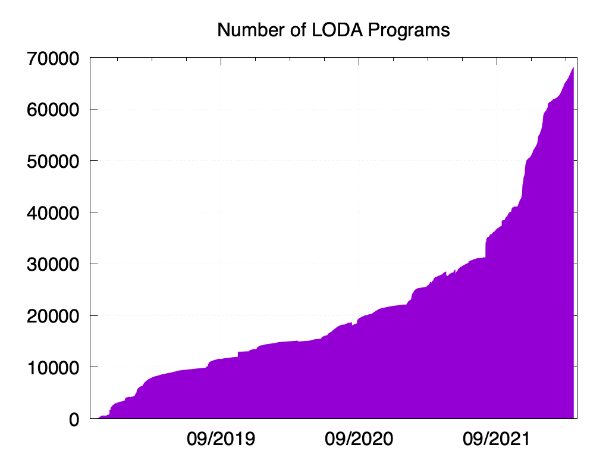

# LODA Statistics

The `loda` comand-line tool automatically generates and maintains statistics
of all programs in the folder `$HOME/.loda/stats`. Below you can find some charts
showing a small subset of the statistics.

## Dependency Graph

The following image shows the dependencies of LODA programs. A program depends on another if it calls it using a `cal` operation. 

